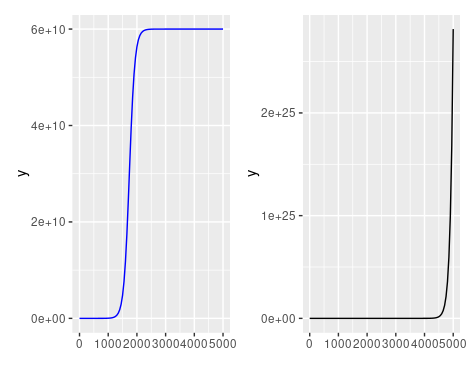

\# INSERT ANSWERS HERE \#

Q1-

This code models the growth of a culture of E.Coli It does this by estimating the rate of growth, starting population size and carrying capacity of the E.Coli

**First we used plot_data.R to create a graph of log(N) against t**

First I plotted the logistic growth data In plot_data.R we called the data from **experiment 1.csv** as growth_data)

I used the package ggplot2 to plot the time (t) against bacteria population (N) on a graph

After this I transformed the data so that we plotted time passed against the log function of number of bacteria. This was done to determine if we could observe a linear relationship between time passed and the log function of the number of species.

**Then we used fit_linear_model.R to determine our N0, r and k values given different conditions for t**

Under the first conditions N is very small compared to K

I used the linear model function (lm()) to determine the y intercept and gradient of a graph with certain conditions for t n and k. First I used a model where N \<\< K and where t is small. In this model we used t \< 300 and plotted t against log(N(t))

This gave us values for r and N0 which were as follows:

**RESULTS**

r = 0.013516 - which is our gradient

N0 = 6.8421256e - which is our y intercept

To determine the carrying capacity we looked at a scenario where t was large so that N(t) = k

We inputted t \>(3000) into our model and got this values

K = 6e\^10

**Then we used plot_data_and_model to input these values of N0,r and k into a linear model, confirming that they were the correct values**

when we did this - we observed the same graph as given by our data plot, confirming these values for N0,r and k.

Q2 -

The exponential graph gave a value of 2.289804exp(25) at t = 4980 -this is far larger than the size predicted at this time for logistic growth

Q3 -

{width="260"}

